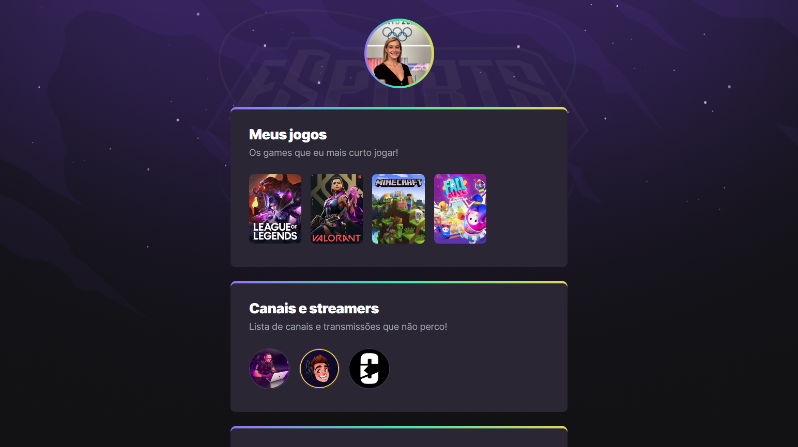

# 💻 NLW eSports - Trilha Explorer



> Explorer Path

Project developed during the Next Level Week (NLW) event organized by [Rocketseat](https://www.rocketseat.com.br/).

The project aims to create a landing page with [CSS](https://developer.mozilla.org/en-US/docs/Web/CSS) animations and gradients to present the games and streaming channels that a user can like and follow daily.

👉 ​[🔗​ Click here to access the project!](https://ma-oliveiramarques.github.io/nlw-eSports/)

# 🎨​ Layout

You can access the layout of this project through this [link](https://www.figma.com/community/file/1150897317533332617). You'll need to sign or have a [Figma's](https://www.figma.com/) account to access the project.

# 🚀​ Tecnologies

This project was developed with the following technologies:

- [HTML](https://developer.mozilla.org/en-US/docs/Web/HTML)
- [CSS](https://developer.mozilla.org/en-US/docs/Web/CSS)
- [Git](https://git-scm.com/)
- [Github](https://docs.github.com/pt)

## ⚙️Setup

## Run locally

Create and go to the directory where you want to place the repository

```bash
    cd directory
```

Clone the project

```bash
  git clone https://github.com/ma-oliveiramarques/nlw-eSports.git
```

Go to the project directory

```bash
  cd nlw-eSports
```

Open in Visual Studio Code

```bash
  code .
```

# 📝​ License

MIT
